<p align="center">
  
</p>

<p align="center">
  
  
</p>

Capsules of code and notes launched from the home vault toward the work machine.
Each pod is one directory, `YYYY-MM-DD-<subject>/`, holding a `README.md` (context,
decisions, how to apply) and the code as **real files** ready to copy.

> **Public on purpose.** No secret, no credential, no employer code or internal name
> ever rides in a pod.

## 🛰️ How it flies

```
  home vault ──── /drop-pod ────▶  Arylmera/Drop-Pod  ────▶ git pull ────▶ work machine
  (discussion)   writes the pod      (public repo)          pod-receive     (apply)
```

## 📡 Receiving side

Once:

```bash
git clone https://github.com/Arylmera/Drop-Pod.git
```

Each time a pod lands:

```bash
git pull
git log -1 --stat
```

Open the directory shown, read its `README.md`, copy the files.

## 🤖 Agent on the receiving side

A skill for the receiving agent ships in this repo:
[`.claude/skills/pod-receive/SKILL.md`](.claude/skills/pod-receive/SKILL.md).
Running Claude Code inside this clone loads it automatically. To use it from the target
project instead, copy that directory once into `~/.claude/skills/` (global) or into the
project's `.claude/skills/`. It knows the pod contract below and applies a pod step by step.

## 📦 Pod contract

| Section | Holds |
|---|---|
| `## Context` | Two lines: the problem and the target project. `follows <pod>` when it continues one. |
| `## Decisions` | Choices already made. Not reopened on the receiving side. |
| `## Apply` | Ordered steps; a copy step names the file and its destination. |
| `## Files` | One bullet per shipped file and its role. |

Code is shipped as real files with their final names; the README never carries code.
A pod is never edited after landing.

## 🪂 Pods

<!-- pods:index -->
<!-- /pods:index -->
